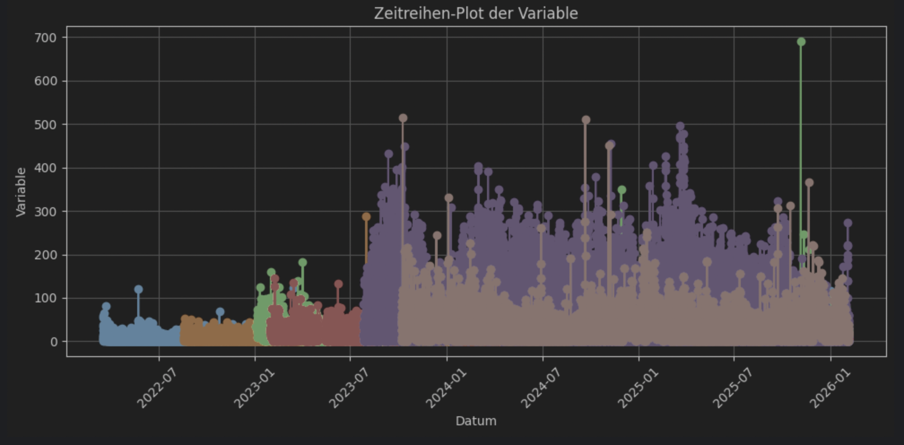
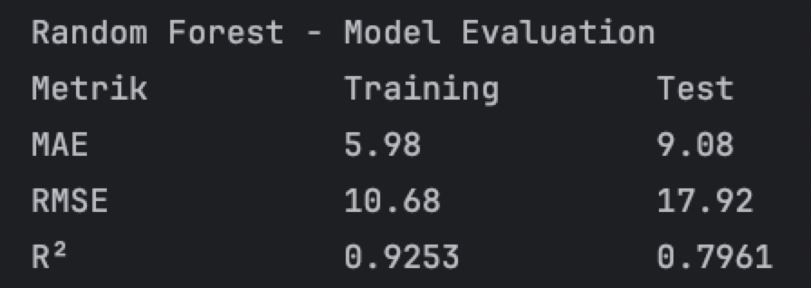

# Pedestrian_Forecast_DataScience Dokumentation

## 1 Lineares Regressionsmodell Evaluation:

## 2 Random Forest Evaluation:

## 3 Plot:

## 4 Corrected:
Mit corrected ist es schlechter geworden:

## 5 uptime auf mindestens 0,5:
Dann uptime abgeschnitten wenn weniger als 0,5:

Damit ist es besser geworden beim Training. Allerdings beim Test kann es noch verbessert werden. (Das Modell overfittet noch)

## 6 Cross Validierung und Hyperparameter Tuning:

## 7 Weitere Features:
"year", "day" und "segment id" kommen hinzu. Das Modell ist damit besser geworden.

