# Pedestrian_Forecast_DataScience Dokumentation

## Projektentwicklung

Wir wollen mit lokalen Berliner und Open Source Daten arbeiten.
Ende 2025 fiel unsere Wahl auf Daten des interessanten Citizen Science Projekts "Berlin zählt Mobilität" des ADFC Berlin und des DLR (Deutschen Zentrums für Luft- und Raumfahrt). Auf der Projektseite findet sich ein Dashboard mit den aktuell erhobenen Daten (ADFC Berlin und DLR (2026)).
Es werden Telraam Geräte an Einwohner*innen Berlins verliehen, die sie im 1. Stock eines Gebäudes aufstellen. Die Telraam Geräte erfassen automatisiert Fußverkehr, Zweiräder, PKW und größere Fahrzeuge (Telraam (2026a)). 
Für eine gelungene Modellierung wollen wir weitere Daten miteinbeziehen. 
Da wir Wetterdaten für den Fußverkehr für relevant halten, haben wir Daten einer Wetterstation des DWD (Deutscher Wetterdienst) miteinbezogen.

## Datengrundlage 

Für unsere Modelle nutzen wir Daten der unter "Datenquellen" genannten Quellen. 
Die Station "Tempelhofer Feld" des DWD hat einen umfangreichen Datensatz, der eine weitreichende zeitliche Überschneidung mit den Daten des Telraam gewährleistet.
Ausgehend von der Wetterstation haben wir in einem Umkreis von 2 km 6 passende Telraam Sensoren gefunden, die verschieden große/von Autos befahrene Straßen repräsentieren. Durch die kleinräumige Verteilung der Telraam Sensoren wollen wir eine Verbesserung von Modellen durch die Wetterdaten wahrscheinlicher machen.

### Telraam

Wir nutzen folgende 6 Telraam Sensoren (siehe Abb. 1):
Zählernummer 3310 in der Manfred-von-Richthofen-Straße 
Zählernummer 4118 in der Weserstraße 210
Zählernummer 4602 in der Bendastraße 11
Zählernummer 4685 in der Emserstraße 122
Zählernummer 5444 im Britzer Damm 5
Zählernummer 5832 in der Donaustraße 131

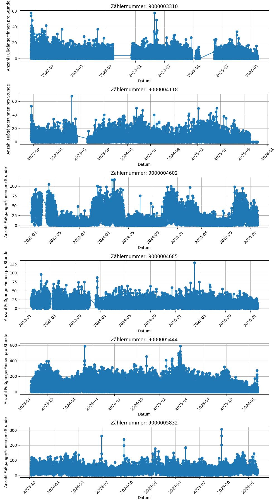
 
Abb.1: Übersicht der Fußgänger*innen pro Stunde je Zähler

Folgende stündliche Daten der Telraam Datensätze gehen in unsere Modelle ein:
"date_local": Startzeitpunkt der Messung, quasi stetige stündliche Werte 
"uptime": Wert liegt zwischen 0 und 1. Prozentzahl der Zeit, die tatsächlich gemessen wurde. 
Normalerweise liegt dieser Wert bei 0.75, da die restliche Zeit für interne Berechnungen verwendet wird. 
Außerdem messen die Sensoren nicht bei Dunkelheit, deswegen ist uptime während der Dämmerung relevant.
Wir haben uptime <0.5 rausgefiltert um die Datenqualität zu verbessern. 
Außerdem wurde uptime > 1 gelöscht, weil für die Stunde nur Daten für eine Stunde und nicht länger vorliegen sollten.

"car_total": Anzahl der Autos (Summe der Autos von rechts und von links).
Es wurde car_total nach Telraam (2026b) mittels "uptime" auf stündliche Werte hochgerechnet. car_total hat 17854 fehlerhafte Einträge. Allerdings handelt es sich um einen systematischen Fehler von +/- 1 . Wir entscheiden uns die Werte im Dataframe zu behalten und nicht zu korrigieren.

"car_speed" 10 -70: Verteilung der Autogeschwindigkeit in bins von 10 km/h, z.B. ist der erste bin 0 km/h-10 km/h etc. Die Einheit ist in % der totalen 100 % der Geschwindigkeiten angegeben (Postman(2026)).
Die Summe der bins wurden überprüft und ergeben zusammen immer 100.

"bike_total": Anzahl der Fahrräder (Summe der Fahrräder von rechts und von links).
Es wurde bike_total nach Telraam (2026b) mittels "uptime" auf stündliche Werte hochgerechnet. bike_total hat 16042 fehlerhafte Einträge. Allerdings handelt es sich um einen systematischen Fehler von +/- 1 . Wir entscheiden uns die Werte im Dataframe zu behalten und nicht zu korrigieren.

"ped_total": Anzahl der Fußgängerinnen (Summe der Fußgängerinnen von rechts und von links).
Es wurde ped_total nach Telraam (2026b) mittels "uptime" auf stündliche Werte hochgerechnet.
Wir haben nur Fußverkehr, der kleiner als 1800 ist verwendet, um die Datenqualität zu verbessern.
ped_total hat 12058 fehlerhafte Einträge. Allerdings handelt es sich um einen systematischen Fehler von +/- 1 . Wir entscheiden uns die Werte im Dataframe zu behalten und nicht zu korrigieren.

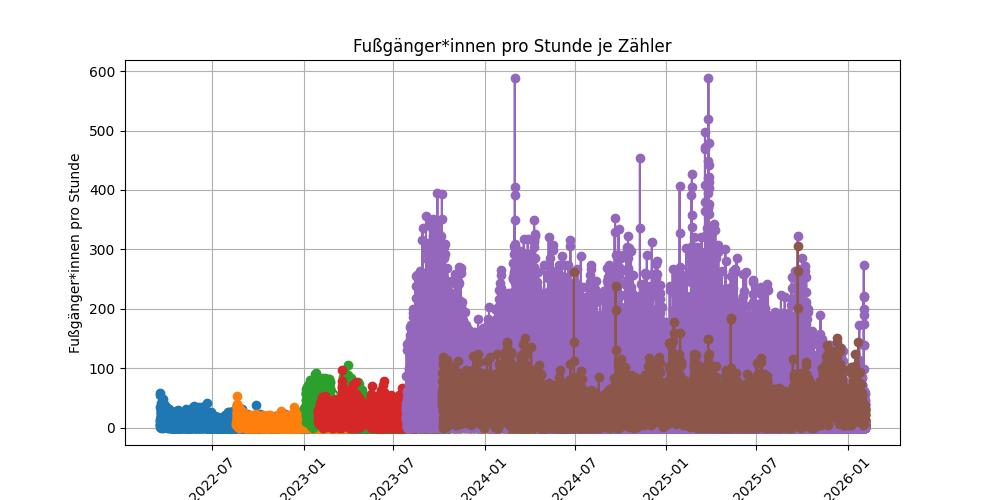
 
Abb.2: Fußgängerinnen pro Stunde aller verwendeten Zähler

 
Informationen zu den Variablen finden sich bei Postman (2026) und zu Berechnung der Variablen bei Telraam (2026b).

### Klimadaten

Wir nutzen stündliche Werte der Wetterstation des DWD auf dem Tempelhofer Feld (Station Nummer 433).
Folgende Wetterdaten sind in die Modelle integriert:
Temperatur [°C]: Temperatur in 2 m Höhe. Daten wurden auf Plausibilität geprüft.
Niederschlagshöhe [mm]: Niederschlag. Daten wurden auf Plausibilität geprüft.
Es wurden Daten mit -999 mit dem Median ersetzt.

### Datumsdaten

Wir haben verschiedene Informationen aus dem Datum generiert. Um die Datensätze zu mergen wurde das Datum in ein datetime Format überführt.
Über Datetime haben wir am Ende der Datenvorbereitung die Variablen "stunde", "tag", "monat", "jahr", DOY (Tag im Jahr), "wochentag" und "wochenende" generiert.
Die Wochentage "Mo", "Di", "Mi", "Do", "Fr", "Sa", "So" haben wir one-hot encoded nach VanderPlas (2004, S. 445 f.).

## Material und Methoden

Für das Projekt nutzten wir die Software Python 3.13.7, als IDE Visual Studio Code und PyCharm jeweils mit Jupyter. 
Für die Arbeit mit Daten verwendeten wir das Paket Pandas und für das Modellieren das Paket Scikit-Learn.

## Ziel des Projektes

Mittels maschinellem Lernen soll ein Modell erstellt werden, welches bei Ausfällen der Zählung oder Berechnung der Anzahl von Fußgänger*innen mithilfe von Wetterdaten und den verbleibenden Anzahl von Autos und von Fahrrädern helfen kann Datenlücken zu füllen.

## Modellierung

Die Variable, die wir vorhersagen wollen ist die Anzahl an Fußgänger*innen (ped_total_corrected). 
Die Features, die in die jeweiligen Modelle eingehen wurden je Modell ausgewählt.
Wir haben verschiedene Features ausprobiert, um die Performance der Modelle zu verbessern. 
In dem Prozess haben wir zwischenevaluiert und die Fehlermetriken und Scores miteinander verglichen.
Zur Modellierung splitten wir den Datensatz in eine Trainings- und eine Testmenge. 
Für die Bewertung der Modelle wurde der mittlere absoluter Fehler (MAE), der Standardschätzfehler (RMSE) (Vanderplas, 2024, S. 586)und das Bestimmtheitsmaß (R²) herangezogen.

### Baselinemodell

Datengrundlage des Baselinemodells sind die Werte der Fußgänger*innen aller Zähler (siehe Abb.2)

Beim Baselinemodell nutzen wir jeweils den Mittelwert der Fußgänger*innen von Testmenge und von Trainingsmenge zur Vorhersage. 

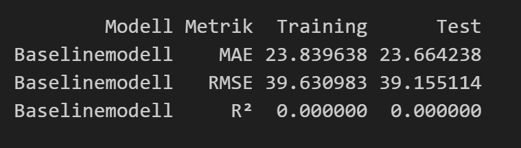
  Abb. 3: Baslinemodell aus dem Mittelwert der Fußgänger*innen mit mittlerem absoluter Fehler (MAE), Standardschätzfehler (RMSE) und Bestimmtheitsmaß (R²)

### Lineares Modell

Die Annahmen für eine Linare Regression sind: 
-Linearität
-Unabhängigkeit, identisch vertieltes Rauschen
-Homoskedastizität
-Normalverteiltes Rauschen der Fehlerterme (Mihaljević, 2023, DS CourseBook)

Wir haben die 4 Annahmen geprüft, allerdings sind die Voraussetzungen nicht ganz erfüllt. 
Da es sich aber nicht um ein statistisches Modell handelt nutzen wir besonders um
die Einflussnahmen der einzelnen Features sichtbar zu machen, wenn sie einen linearen Zusammenhang haben,
die lineare Regression (siehe Abb. 4b).

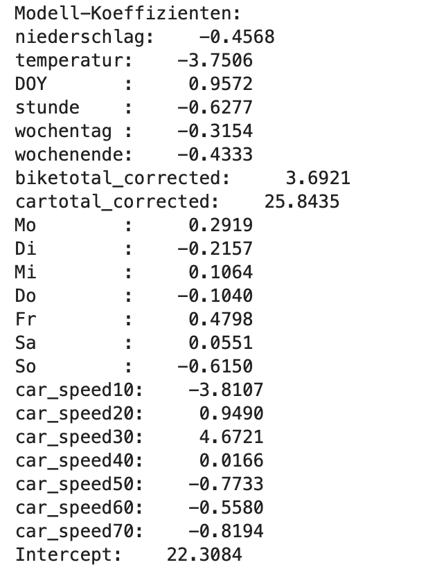
  Abb. 4b: Finale Koeffizienten des Linearen Modells

Das Lineare Modell liefert schon bessere Ergebnisse als das Baselinemodell, beim Test liegt R2 bei etwa 0,46 und der MAE beim 18,30.

#### Anpassen von Variablen
In Abb. 4 sieht man die Ergebnisse, nach dem Training eines linearen Regressionsmodells mit täglichen Wetterdaten und ohne DOY (Day of Year). 

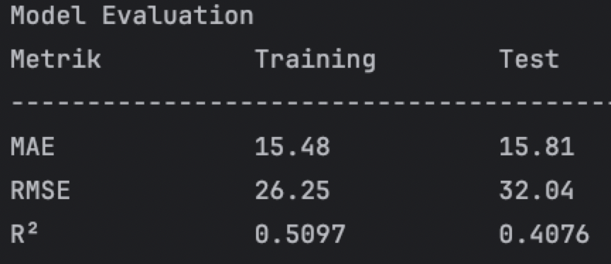
  Abb. 4: Lineares Regressionsmodell mit mittlerem absoluter Fehler (MAE), Standardschätzfehler (RMSE) und Bestimmtheitsmaß (R²)

Nach Korrektur mit uptime der Anzahl der Fußgänger*innen, Verwendung von täglichen Wetterdaten und 
hinzufügen von DOY overfittet das Modell nicht mehr so stark.

### Random Forest Modell

Das Random Forest Modell liefert gute Ergebnisse. In Abb. 5 sieht man die erste Version des Modells. Hier wurde noch nicht mit uptime korrigiert und es wurde mit täglichen Wetterdaten und ohne DOY trainiert.

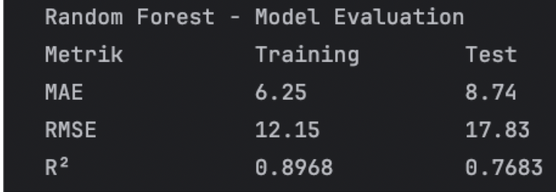
  Abb. 5: Random Forest Modell erste Version mit mittlerem absoluter Fehler (MAE), Standardschätzfehler (RMSE) und Bestimmtheitsmaß (R²)

#### Anpassungen/Änderungen der Features bei Random Forest Modell:
Mit der "uptime"- Korrektur von Fußgänger*innnen, Fahrradfahrerinnen und Autos performt das Modell in der zweiten Version schlechter (siehe Abb. 6)

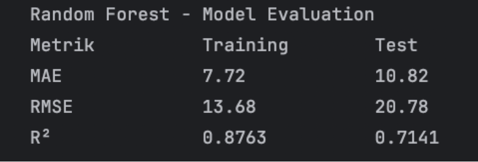
  Abb. 6: Random Forest Modell zweite Version mit mittlerem absoluter Fehler (MAE), Standardschätzfehler (RMSE) und Bestimmtheitsmaß (R²)

Mit dem Löschen von Daten uptime wenn weniger als 0,5:
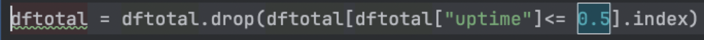

performt das Modell in der dritten Version wieder besser (siehe Abb.7)
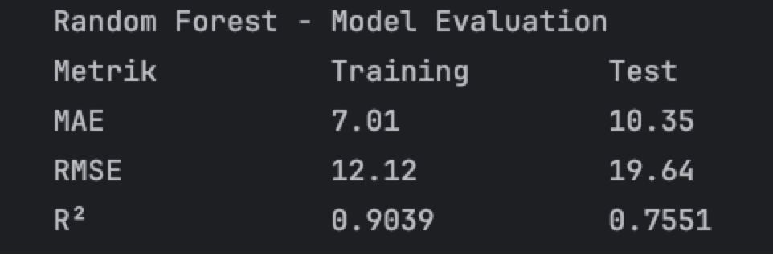
 Abb. 7: Random Forest Modell dritte Version mit mittlerem absoluter Fehler (MAE), Standardschätzfehler (RMSE) und Bestimmtheitsmaß (R²)

In unserer vierten Version wurden (siehe Abb. 8) konnte die performance des Modells nochmal verbessert werden. 

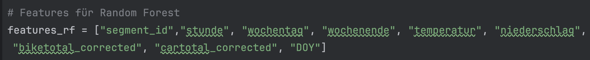
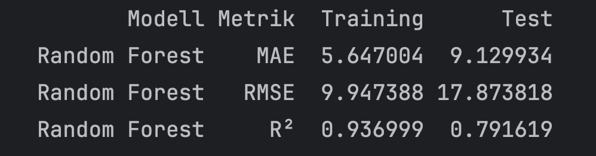
  Abb. 8: Random Forest Modell vierte Version mit mittlerem absoluter Fehler (MAE), Standardschätzfehler (RMSE) und Bestimmtheitsmaß (R²)

In der finalen Version (siehe Abb.9) mit Hinzunahme der Autogeschwindigkeiten sieht das Modell nun folgendermaßen aus:

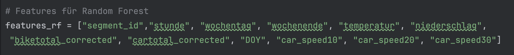
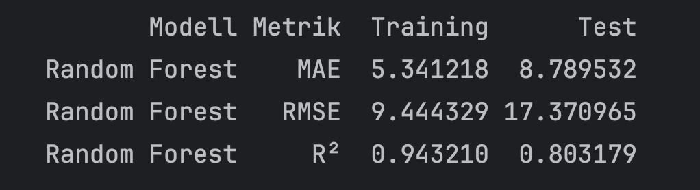
  Abb. 9: Random Forest Modell finale Version mit mittlerem absoluter Fehler (MAE), Standardschätzfehler (RMSE) und Bestimmtheitsmaß (R²)

 Allerdings sollte der Testfehler noch verbessert werden. Es liegt ein Overfitting vor, welches wir versuchen mit Anpassung der Hyperparamter zu beheben.

### Cross Validierung und Hyperparameter Tuning für Random Forest Modell:

Durch die Verwendung von Crossvalidierung für die Auswahl der besten Hyperparameter konnten wir das Modell leicht verbessern. Es bleibt jedoch bei einem Overfitting.

###  Zwischenstand mit Features:
Die Features "year", "day" und "segment id" werden hinzugenommen. Das Modell ist damit besser geworden.

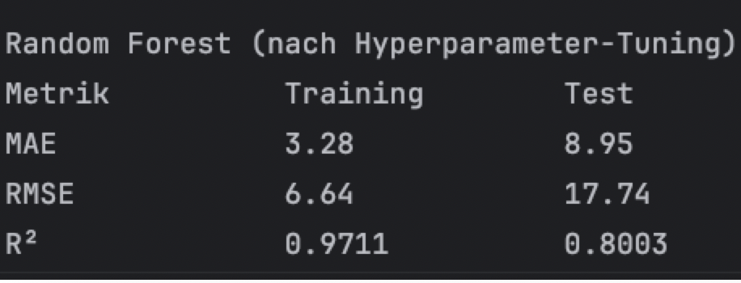
  Abb. 9: Random Forest Modell nach Hyperparametertuning mit mittlerem absoluter Fehler (MAE), Standardschätzfehler (RMSE) und Bestimmtheitsmaß (R²)

Das Random Forest Modell nach Hyperparametertuning unter Nutzung der finalen Variablen ist in Abb. 10 zu sehen.

## Zusammenfassung

In Abbildung 10 sind die finalen Modelle im Vergleich zu sehen.
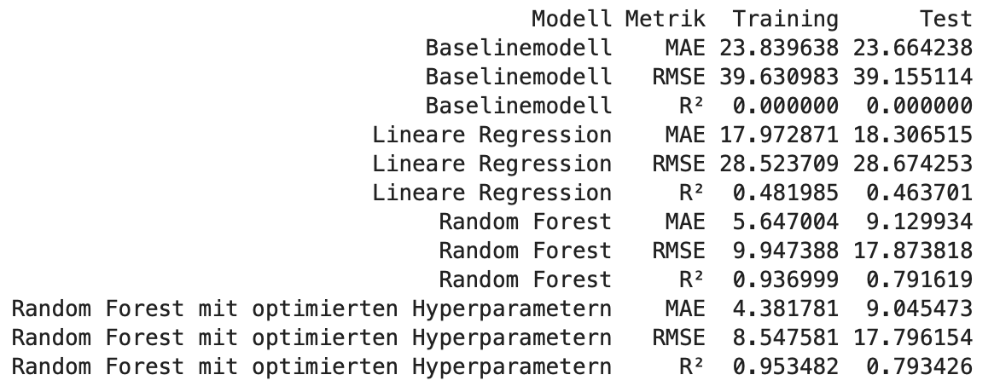
  Abb. 10: Übersicht aller Modelle mit absoluter Fehler (MAE), Standardschätzfehler (RMSE) und Bestimmtheitsmaß (R²)

Durch den Mittelwert konnte keine Vorhersage für die Anzahl der Fußgänger*innen getroffen werden. 
Eine lineare Regression bewirkt ebenfalls keine gute Vorhersage. 
Durch Random Forest ist die Vorhersage gut. Leider bleibt ein Overfitting und ein MAE von 9 weiterhin bestehen.

## Ausblick

Im Zuge der Beschäftigung der Daten sind uns weitere interessante Fragestellungen begegnet, die in einem umfangreicheren Projekt oder einer Abschlussarbeit behandelt werden könnten.

Folgende weitere Fragestellungen könnten verfolgt werden:
- einen ausgefallenen Telraam Sensor mithilfe eines Modells auf Grundlage der Daten anderer Sensoren ersetzen
- die Generalisierbarkeit des Modells auf Berlin, andere S2 Telraam Sensoren testen
- unter Einbezug von räumlichen Daten und der Fußgänger*innen von rechts und von links die Laufkundschaft von Läden mit einem Modell vorhersagen

## Datenquellen 

"Berlin zählt Mobilität", bereitgestellt von ADFC Berlin und DLR, abgerufen von https://daten.berlin.de/datensaetze/berlin-zaehlt-mobilitaet unter der Lizenz CC BY 4.0 (https://creativecommons.org/licenses/by/4.0/)   

"Stündliche Klimadaten Regen und Temperatur", bereitgestellt vom DWD, abgerufen von https://opendata.dwd.de/climate_environment/CDC/observations_germany/climate/hourly/ unter der CC BY 4.0 (https://creativecommons.org/licenses/by/4.0/)   

## Literaturquellen

ADFC Berlin und DLR (2026) Berlin zählt Mobilität. Abgerufen am 11.03.2026 von https://we-count.codefor.de/

Postman (2026) Public API TELRAAM 1.2. Abgerufen am 11.03.2026 von https://documenter.getpostman.com/view/8210376/TWDRqyaV#3bb3c6bd-ea23-4329-b885-0d142403ecbb

Telraam (2026a) Berlin zählt Mobilität. Abgerufen am 11.03.2026 von https://telraam.net/en/S2

Telraam (2026b) Understanding the Telraam API. Abgerufen am 11.03.2026 von https://faq.telraam.net/api-introduction

VanderPlas, J. (2024) Handbuch Data Science mit Python. 1. Auflage, dpunkt.verlag GmbH.

Mihaljević, H. (2023), DataScience CourseBook

Der KI-Assistent der HTW Berlin wurde für Fragestellungen zum Code genutzt.